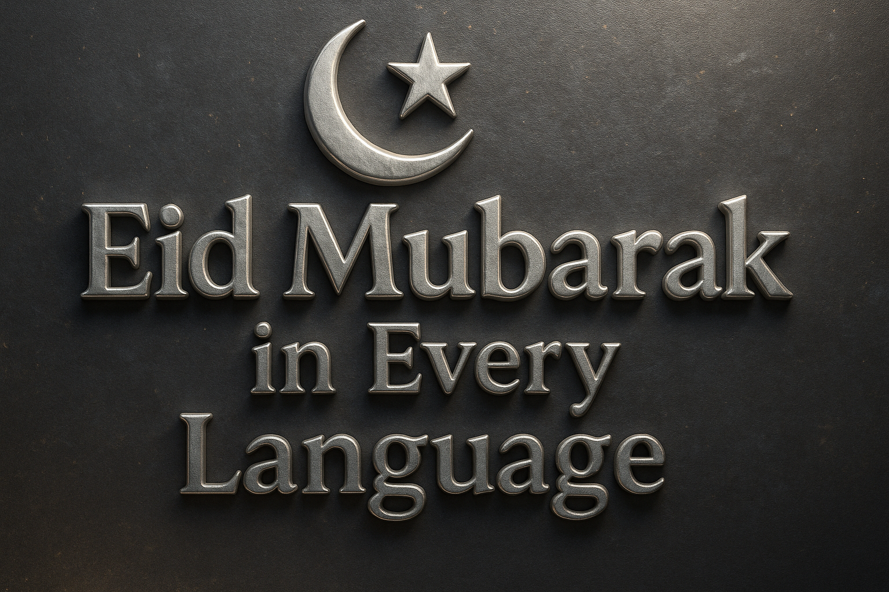

  

# 🌙 Eid Mubarak in Every Language

Welcome to the **Eid Mubarak in Every Language** repository—celebrating the universal message of unity, generosity, and joy during the festivals of **Eid al-Fitr** and **Eid al-Adha (Bakr Eid)**.

Eid festivals symbolize compassion, gratitude, sacrifice, and unity, transcending cultural and geographical boundaries. Through this repository, we highlight the beautiful diversity of how people around the world express these heartfelt wishes.

Whether it's marking the end of Ramadan (Eid al-Fitr) or commemorating Prophet Ibrahim’s devotion and sacrifice (Eid al-Adha), these celebrations bring together hearts and communities worldwide.

---

## 🌍 Eid Wishes Around the Globe

Explore how people across the globe say "Eid Mubarak":

| Language             | Eid Wish                                |
|----------------------|-----------------------------------------|
| Arabic               | عيد مبارك                               |
| Urdu                 | عید مبارک                               |
| Turkish              | Bayramınız mübarek olsun                |
| French               | Bonne fête de l'Aïd                     |
| Malay                | Selamat Hari Raya Aidilfitri            |
| Indonesian           | Selamat Idul Fitri                      |
| Hindi                | ईद मुबारक                              |
| Bengali              | ঈদ মোবারক                              |
| Punjabi              | ਈਦ ਮੁਬਾਰਕ                              |
| Gujarati             | ઈદ મુબારક                              |
| Tamil                | ஈத் முபாரக்                             |
| Telugu               | ఈద్ ముబారక్                            |
| Kannada              | ಈದ್ ಮುಬಾರಕ್                           |
| Malayalam            | ഈദ് മുബാറക്                            |
| Sinhala              | ඊද් මුබාරක්                            |
| Swahili              | Eid Mubarak                             |
| Somali               | Ciid wanaagsan                          |
| Hausa                | Barka da Sallah                         |
| Amharic              | ኢድ ሙባረክ                              |
| Persian              | عید مبارک                               |
| Pashto               | د اختر مبارکي                          |
| Kurdish              | Cejna we pîroz be                       |
| Azerbaijani          | Bayramınız mübarək                      |
| Kazakh               | Ораза айт мейрамы құтты болсын          |
| Uzbek                | Hayit bayramingiz muborak bo‘lsin       |
| Russian              | Ид мубарак                              |
| Ukrainian            | Ід мубарак                              |
| Bosnian              | Bajram Šerif Mubarek Olsun              |
| Albanian             | Gëzuar Bajramin                         |
| German               | Gesegnetes Eid                          |
| Spanish              | Feliz Eid                               |
| Portuguese           | Feliz Eid                               |
| Italian              | Buona Festa di Eid                      |
| Dutch                | Gezegend Eid                            |
| Romanian             | Sărbătoare fericită de Eid              |
| Chinese (Simplified) | 开斋节快乐                               |
| Chinese (Traditional)| 開齋節快樂                               |
| Japanese             | イード・ムバーラク                      |
| Korean               | 이드 무바라크                            |
| Thai                 | อีฎมูบารัก                               |
| Vietnamese           | Chúc mừng Eid                           |
| Filipino             | Maligayang Eid                          |
| Mongolian            | Ид мубарак                              |
| Greek                | Εΐντ Μουμπάρακ                          |
| Hebrew               | עיד מובארכ                              |
| English              | Eid Mubarak                             |

---

## ✨ Celebrating Eid al-Fitr & Eid al-Adha

**Eid al-Fitr** marks the end of the holy month of Ramadan, celebrated by communal prayers, feasting, and giving to the needy.

**Eid al-Adha (Bakr Eid)** commemorates Prophet Ibrahim’s willingness to sacrifice his son, emphasizing generosity, charity, and sharing meat with the less fortunate.

Both festivals strengthen bonds of compassion, gratitude, and togetherness across communities globally.

---

## 🌟 Our Message to You

> **Eid Mubarak!**  
> May these blessed occasions fill your hearts with joy, your homes with peace, and your communities with harmony.
> Let’s celebrate our diversity and cherish the bonds that unite us.

**Wishing you peace and joy, wherever you are in the world.**
